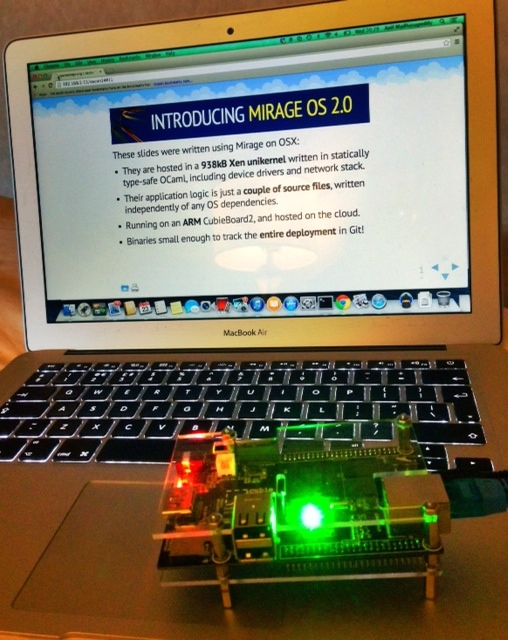
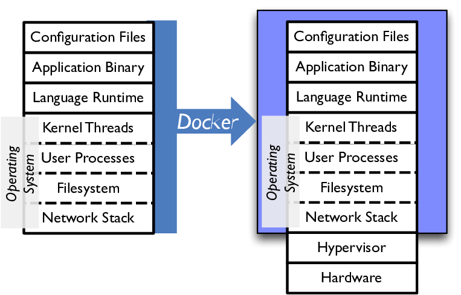
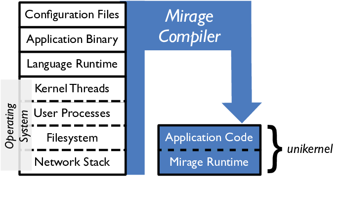
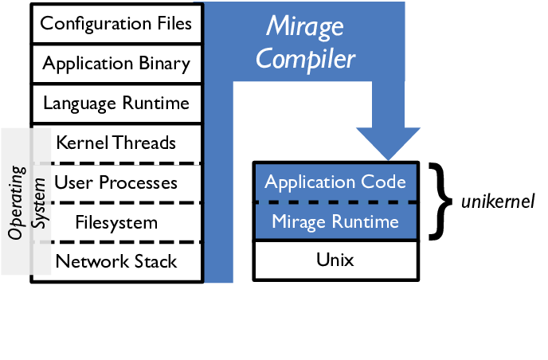
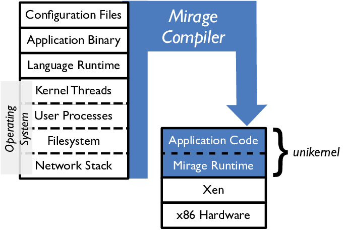
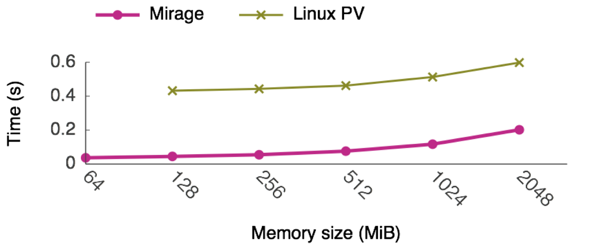
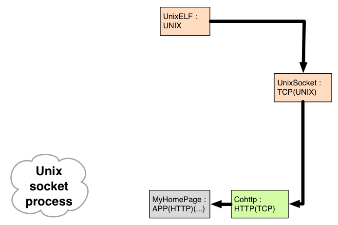
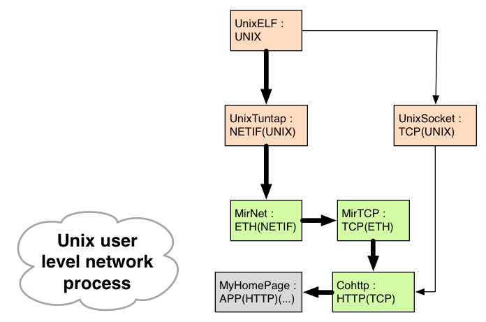
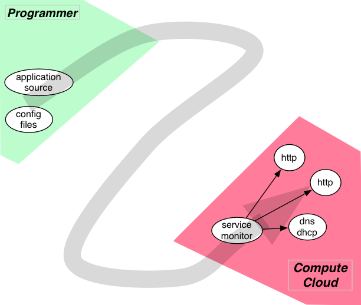
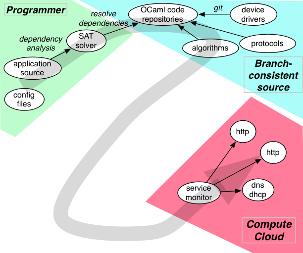

<!-- .slide: class="title" -->

# __[The Mirage Tutorial](http://tutorial.openmirage.org/)__

Richard Mortier <small>University of Nottingham</small>
[@mort\_\_\_](http://twitter.com/mort___)

Anil Madhavapeddy <small>University of Cambridge</small>
[@avsm](http://twitter.com/avsm)

[http://openmirage.org/](http://openmirage.org/)<br/>

<small>
  Press &lt;esc&gt; to view the slide index, and the &lt;arrow&gt; keys to
  navigate. <br />
  Slides are arranged in a 2D grid, with each vertical column
  corresponding to a single topic.
</small>


----

## Before We Begin...

If you would like to follow along with these examples (and we recommend you do!)
you will need to:

+ install OCaml and the `opam` package manager, e.g.:

      $ brew install ocaml opam
      $ eval `opam config env`
<!-- .element: class="no-highlight" -->

+ install Mirage:

      $ opam install mirage
<!-- .element: class="no-highlight" -->

More details, including instructions for non-OSX platforms, can be found on the
[OpenMirage website](http://openmirage.org/wiki/install).


## Samples

You can also grab copies of all the samples used in this tutorial by cloning the
appropriate repositories:

      $ git clone https://github.com/mirage/mirage-tutorial
      $ git clone https://github.com/mirage/mirage-skeleton
<!-- .element: class="no-highlight" -->

The former contains this slide deck and the associated IOCaml notebooks; the
latter contains extensive working sample code, including all the examples we
will present, and more!

If you wish to run the IOCaml notebooks yourself, you will also need to install
IOCaml and point it to them:

      $ opam install iocaml
      $ iocaml -completion mirage-tutorial/notebooks
<!-- .element: class="no-highlight" -->


----

## Introducing [Mirage OS 2.0](http://openmirage.org/)

These slides were written using Mirage on OSX:

- They are hosted in a **938kB Xen unikernel** written in statically type-safe
  OCaml, including device drivers and network stack.

- Their application logic is just a **couple of source files**, written
  independently of any OS dependencies.

- Running on an **ARM** CubieBoard2, and hosted on the cloud.

- Binaries small enough to track the **entire deployment** in Git!


## Introducing [Mirage OS 2.0](http://openmirage.org/)

<p class="stretch center">
  
</p>


## Leaning Tower of Cloud

<div class="left" style="width: 65%">
  <p>Numerous pain points:</p>
  <ul>
    <li>**Complex** configuration management.</li>
    <li>Duplicated functionality leads to **inefficiency**.</li>
    <li>VM image size leads to **long boot times**.</li>
    <li>Lots of code means a **large attack surface**.</li>
  </ul>
</div>

<p class="right">
  
  <br />
  <small class="right">
    https://flic.kr/p/8N1hWh
  </small>
</p>


## Complexity Kills You

The enemy is **complexity**:

+ Applications are **deeply intertwined** with system APIs, and so lack
  portability.

+ Modern operating systems offer **dynamic support** for **many users** to run
  **multiple applications** simultaneously.

Almost unbounded scope for uncontrolled interaction!

<!-- .element: class="fragment" data-fragment-index="1" -->

+ Choices of distribution and version.
+ Ad hoc application configuration under `/etc/`
+ Platform configuration details, e.g., firewalls.

<!-- .element: class="fragment" data-fragment-index="1" -->


## Docker: Containerisation

<p class="stretch center">
  
</p>
<p>
  <small class="right">
    https://flic.kr/p/qSbck
  </small>
</p>


## Docker: Containerisation

Docker bundles up all this state making it easy to transport, install and manage.

<p class="stretch center">
  
</p>


## Can We Do Better?

**Disentangle applications from the operating system**.

- Break up operating system functionality into modular libraries.

- Link only the system functionality your app needs.

- Target alternative platforms from a single codebase.


----

## The Unikernel Approach

> Unikernels are specialised virtual machine images compiled from the full stack
> of application code, system libraries and config

<br/>
This means they realise several benefits:
<!-- .element: class="fragment" data-fragment-index="1" -->

+ __Contained__, simplifying deployment and management.
+ __Compact__, reducing attack surface and boot times.
+ __Efficient__, able to fit 10,000s onto a single host.

<!-- .element: class="fragment" data-fragment-index="1" -->


## It's All Just Source Code

Capture system dependencies in code and compile them away.<br/>
<span class="right" style="width: 15em">
  &nbsp;
</span>

<p class="stretch center">
  
</p>


## Retarget By Recompiling

Swap system libraries to target different platforms:<br/>
<span class="right">**develop application logic using native Unix**.</span>

<p class="stretch center">
  
</p>


## Retarget By Recompiling

Swap system libraries to target different platforms:<br/>
<span class="right">**test unikernel using Mirage system libraries**.</span>

<p class="stretch center">
  
</p>


## Retarget By Recompiling

Swap system libraries to target different platforms:<br/>
<span class="right">**deploy by specialising unikernel to Xen**.</span>

<p class="stretch center">
  
</p>


## End Result?

Unikernels are compact enough to boot and respond to network traffic in
real-time.

<table style="border-bottom: 1px black solid">
  <thead style="font-weight: bold">
    <td style="border-bottom: 1px black solid; width: 15em">Appliance</td>
    <td style="border-bottom: 1px black solid">Standard Build</td>
    <td style="border-bottom: 1px black solid">Dead Code Elimination</td>
  </thead>
  <tbody>
    <tr style="background-color: rgba(0, 0, 1, 0.2)">
      <td>DNS</td><td>0.449 MB</td><td>0.184 MB</td>
    </tr>
    <tr>
      <td>Web Server</td><td>0.674 MB</td><td>0.172 MB</td>
    </tr>
    <tr style="background-color: rgba(0, 0, 1, 0.2)">
      <td>Openflow learning switch</td><td>0.393 MB</td><td>0.164 MB</td>
    </tr>
    <tr>
      <td>Openflow controller</td><td>0.392 MB</td><td>0.168 MB</td>
    </tr>
  </tbody>
</table>


## End Result?

Unikernels are compact enough to boot and respond to network traffic in
real-time.




----

## Mirage OS 2.0 Workflow

As easy as 1&mdash;2&mdash;3!

1. Write your OCaml application using the Mirage module types.
   + Express its configuration as OCaml code too!

           $ mirage configure config.ml --unix
<!-- .element: class="no-highlight" -->


## Mirage OS 2.0 Workflow

As easy as 1&mdash;2&mdash;3!

1. Write your OCaml application using the Mirage module types.
   + Express its configuration as OCaml code too!

2. Compile it and debug under Unix using the `mirage` tool.

         $ make depend # install library dependencies
         $ make build  # build the unikernel
         $ make run    # ==> sudo ./_build/main.native
<!-- .element: class="no-highlight" -->


## Mirage OS 2.0 Workflow

As easy as 1&mdash;2&mdash;3!

1. Write your OCaml application using the Mirage module types.
   + Express its configuration as OCaml code too!

2. Compile it and debug under Unix using the `mirage` tool.

3. Once debugged, simply retarget it to Xen, and rebuild!

          $ mirage configure config.ml --xen
          $ make depend && make build
          [ edit the .xl config and start your VM ]
<!-- .element: class="no-highlight" -->

   + All the magic happens via the OCaml module system.


## Modularizing the OS

<p class="stretch center">
  
</p>


## Modularizing the OS

<p class="stretch center">
  
</p>


## Modularizing the OS

<p class="stretch center">
  
</p>


----

## <http://openmirage.org/>

Featuring blog posts by:
[Amir Chaudhry](http://amirchaudhry.com/),
[Thomas Gazagnaire](http://gazagnaire.org/),
[David Kaloper](https://github.com/pqwy),
[Thomas Leonard](http://roscidus.com/blog/),
[Jon Ludlam](http://twitter.com/jonludlam),
[Hannes Mehnert](https://github.com/hannesm),
[Mindy Preston](https://github.com/yomimono),
[Dave Scott](http://dave.recoil.org/),
and [Jeremy Yallop](https://github.com/yallop).

<p style="font-size: 48px; font-weight: bold;
          display: float; padding: 4ex 0; text-align: center">
  Thanks for listening!
  <br/>
  Any questions before we continue?
</p>


----

## Overview

We'll now take you through several core components of Mirage, specifically:

+ __`Lwt`__, the co-operative threading library used throughout Mirage;
+ __`config.ml`__, specifying a unikernel; and
+ __Networking__, from a simple static website to a custom networking stack.


----

## Monads

```
module type MONAD = sig
 type 'a t
 val bind : 'a t -> ('a -> 'b t) -> 'b t
 val return :  'a -> 'a t
end
```
<!-- .element: class="ocaml" -->

* A monad is a box that contains an abstract value.
* Put values in the box with `return`
* Transform them into other values with `bind`


## The Option Monad

Let's implement a monad that expresses optional values, starting in the OCaml interactive toplevel.

```
# Some "apple" ;;
- : string option = Some "apple"

# None ;;
- : 'a option = None

# let return x = Some x ;;
val return : 'a -> 'a option = <fun>

# let maybe u f =
 match u with
 | Some c -> f c
 | None   -> None ;;
val maybe : 'a option -> ('a -> 'b option) -> 'b option = <fun>
```


## Option Monad: definition

```
module OptionMonad = struct
  type 'a t = 'a option

  let bind u f =
   match f with
   | Some x -> f x
   | None   -> None

  let return u = Some u
end
```

The toplevel will report the following type:

```
module OptionMonad = sig
 type 'a t
 val bind : 'a t -> ('a -> 'b t) -> 'b t
 val return :  'a -> 'a t
end
```


## Option Monad: definition

```
module OptionMonad = struct
  type 'a t = 'a option

  let bind u f =
   match f with
   | Some x -> f x
   | None   -> None

  let return u = Some u
end
```

- The value in the box may not exist: `type 'a option`
- `return` places a concrete value in the box.
- `bind` applies a function if it exists or does nothing.

- Note: `f x` application in `bind` is *not* wrapped in `Some`.


## Option Monad: examples

Some simple uses of these definitions:

```
open OptionMonad ;;
bind
 (return 1)
 (fun c -> return (c+1)) ;;
- : int option = Some 2

bind
  None
  (fun c -> return (c+1)) ;;
- : int option = None
```

Binds can be chained to link the results.

```
bind (
 bind
  (Some 1)
  (fun c -> return (c+1))
 ) (fun c -> return (c+1)) ;;
- : int option = Some 3
```


## Option Monad: infix

Infix operators make chaining `bind` more natural:

```
let (>>=) = bind ;;
val ( >>= ) : 'a option -> ('a -> 'b option) -> 'b option = <fun>

return 1 >>= fun c ->
return (c+1) >>= fun c ->
return (c+1) ;;
- : int option = Some 3
```


## Option Monad: infix

Infix operators make chaining `bind` more natural:

```
let (>>=) = bind ;;
val ( >>= ) : 'a option -> ('a -> 'b option) -> 'b option = <fun>

return 1 >>= fun c ->
return (c+1) >>= fun c ->
return (c+1) ;;
- : int option = Some 3
```

Or define a `maybe_add` function to be even more succinct.

```
let maybe_add c = return c + 1 ;;
val maybe_add : int -> int option = <fun>

return 1
>>= maybe_add
>>= maybe_add
- : int option = Some 3
```


## Monad Laws

```
module type MONAD = sig
 type 'a t
 val bind : 'a t -> ('a -> 'b t) -> 'b t
 val return :  'a -> 'a t
end
```

* Monad implementations must satisfy some laws.


## Laws: left identity

```
module type MONAD = sig
 type 'a t
 val bind : 'a t -> ('a -> 'b t) -> 'b t
 val return :  'a -> 'a t
end
```

`return` is a left identity for `bind`

```
return x >>= f
f x
```

Using the OptionMonad:

```
# return 1 >>= maybe_add ;;
- : int option = Some 2

# maybe_add 1;;
- : int option = Some 2

# return (Some 1) >>= maybe_add
```


## Laws: right identity

```
module type MONAD = sig
 type 'a t
 val bind : 'a t -> ('a -> 'b t) -> 'b t
 val return :  'a -> 'a t
end
```

`return` is a right identity for `bind`

```
m >>= return
m
```

Using the OptionMonad:

```
# Some 1 >>= return
- : int option = Some 1

# None >>= return
- : 'a option = None
```


## Monad Laws: associativity

```
module type MONAD = sig
 type 'a t
 val bind : 'a t -> ('a -> 'b t) -> 'b t
 val return :  'a -> 'a t
end
```

`bind` is associative (in an odd way).

```
(u >>= f) >>= g
u >>= (fun x -> f x) >>= g
```

Using the OptionMonad:

```
# Some 3 >>= maybe_add >>= maybe_add ;;
- : int option = Some 5

# Some 3 >>= (fun x -> maybe_add x >>= maybe_add) ;;
- : int option = Some 5
```


----

## Cooperative Concurrency

There are quite a few uses for monads; we'll use this to build a cooperative concurrency model for our OS.

```
module Lwt = struct
 type 'a t
 val bind : 'a t -> ('a -> 'b t) -> 'b t
 val return :  'a -> 'a t
end
```

The `Lwt` (Light Weight Thread) monad signature above represents a *future computation* that is held in the box.

Can construct *futures* and compute using them by using `bind` to operate over its eventual value.


## Constant threads

```
open Lwt ;;
let future_int = return 1 ;;
val future_int : int Lwt.t = <abstr>
```

Build a constant thread by using `return`.

```
let future_fruit = return "apple" ;;
val future_fruit : string Lwt.t = <abstr>

let future_lang = return `OCaml ;;
val future_lang : [> `OCaml] Lwt.t = <abstr>
```

Threads are first-class OCaml values and parametric polymorphism lets you
distinguish different types of threads.

No system threads are involved at all; this is sequential code.


## Concurrency: executing

```
module OS = struct
 val sleep : float -> unit Lwt.t
 val run : 'a Lwt.t -> 'a
end
```

The monad needs to be *executed* to retrieve the future contents.


## Concurrency: executing

```
module OS = struct
 val sleep : float -> unit Lwt.t
 val run : 'a Lwt.t -> 'a
end
```

The monad needs to be *executed* to retrieve the future contents.

```
let t =
 OS.sleep 1.0 >>= fun () ->
 print_endline ">> start";
 OS.sleep 2.0 >>= fun () ->
 print_endline ">> woken up";
 return () ;;
val t : unit Lwt.t = <abstr>
```


## Concurrency: executing

```
module OS = struct
 val sleep : float -> unit Lwt.t
 val run : 'a Lwt.t -> 'a
end
```

The monad needs to be *executed* to retrieve the future contents.

```
let t =
 OS.sleep 1.0 >>= fun () ->
 print_endline ">> start";
 OS.sleep 2.0 >>= fun () ->
 print_endline ">> woken up";
 return () ;;
val t : unit Lwt.t = <abstr>

OS.run t ;;
>> start
>> woken up
```

The `run` function takes a future and unpacks the real value.


## Joinad: not quite a monad

```
module Lwt = struct
 type 'a t
 val bind : 'a t -> ('a -> 'b t) -> 'b t
 val return :  'a -> 'a t

 val join : unit t list -> unit t
 val choose : 'a t list -> 'a t
end
```

We extend the `MONAD` signature with:

- `join` to wait for a list of threads to terminate.
- `choose` to return as soon as one thread of a list completes.
- `join` aliased to `<&>` operator and `choose` as `<?>`.

<br/>
*(see [tomasp.net](http://tomasp.net) and [tryjoinads.org](http://tryjoinads.org) for more background)*


## Example: flip a coin

```
module Lwt = struct
 type 'a t
 val bind : 'a t -> ('a -> 'b t) -> 'b t
 val return :  'a -> 'a t

 val join : unit t list -> unit t
 val choose : 'a t list -> 'a t
end
```

Using `choose` to pick the first thread in a coin flip:

```
let flip_a_coin () =
 let heads =
  OS.sleep 1.0 >>= fun () ->
  return (OS.log "Heads") in
 let tails =
  OS.sleep 2.0 >>= fun () ->
  return (OS.log "Tails") in
 heads <&> tails
```


## Thread representation

```
type 'a t = {
 | Return of 'a
 | Fail of exn
 | Sleep of 'a sleeper
}
and sleeper = {
 waiters : 'a waiter_set;
 <...etc>
}
```

Thread has three main states:

- It has **completed** and contains a concrete `Return` value.
- It has **failed** and contains a concrete `Fail` exception.
- It is **blocked** and waiting on another thread.


## Wakeners and tasks

Each thread executes until it needs to wait on a resource.  It creates
a *task* to let it be woken up in the future.

```
type 'a t  (* thread *)
type 'a u  (* wakener *)
val wait : unit -> 'a t * 'a u
val wakeup : 'a u -> 'a -> unit
```


## Wakeners and tasks

Each thread executes until it needs to wait on a resource.  It creates
a *task* to let it be woken up in the future.

```
type 'a t  (* thread *)
type 'a u  (* wakener *)
val wait : unit -> 'a t * 'a u
val wakeup : 'a u -> 'a -> unit
```

Tasks are a pair: a thread that sleeps until it is fulfilled via its wakener by calling `wakeup` on it.

```
let t1 =
 t >>= fun x ->
 print_endline x;
 return ()
and t2 =
 OS.sleep 2.0 >>= fun () ->
 wakeup u "x";
 return ()
```


## Wakeners: building a timer

Wakeners are enough to build our `OS.sleep` function:

- Call `sleep` with `t` seconds as an argument.
- Create a thread `t` and a wakener `u`.
- Insert `u` into a priority queue ordered by timeout duration.
- Sleep on `t` until `u` is invoked by the scheduler.

Priority queue is a standard data structure ordered by duration.

```
module Sleep_queue =
 Lwt_pqueue.Make(struct
  type t = sleeper
  let compare { time = t1 } { time = t2 } = compare t1 t2
 end)
end
```


## Wakeners: running in Unix

`OS.main` runs until all threads are blocked,
and then drops into the `select` function to wait for the next timeout.

```
run main thread (threads register timeouts)
if result is Blocked then
 T = head of priority queue
 select() for T seconds
 wakeup timeouts
repeat until main thread result is Done or Fail
```

- This lets our sequential code be fully concurrent, without preemptive system threads.
- Number of threads limited only by OCaml heap size.


## Wakeners: running in Xen

Lwt uses the `select` system call in Unix, which blocks the process until some IO event (or a timeout) occurs.

**But how does this translate to Xen?**


## Wakeners: running in Xen

Lwt uses the `select` system call in Unix, which blocks the process until some IO event (or a timeout) occurs.

Xen has an equivalent *VM block instruction* which suspends the whole VM until a device interrupt or timeout.

> **processes in Unix** <=> **Virtual Machines in Xen**

> **`select` in Unix** <=> **block entire VM in Xen**

```
module OS = struct
 val sleep : float -> unit Lwt.t
 val run : 'a Lwt.t -> 'a
end
```


## Wakeners: running in Xen

Lwt uses the `select` system call in Unix, which blocks the process until some IO event (or a timeout) occurs.

Xen has an equivalent *VM block instruction* which suspends the whole VM until a device interrupt or timeout.

> **processes in Unix** <=> **Virtual Machines in Xen**

> **`select` in Unix** <=> **block entire VM in Xen**

Our Xen VM can use this abstraction for all its I/O and timing.

**Question: What is the major downside of this approach?**


----

## A Simple Static Website

Following the console example, building a simple static website adds a couple of extra devices:

+ a __filesystem__, storing the data to be served; and
+ a __web server__, using a high-level abstraction over the network stack.

We'll now walk through the simple example from `mirage-skeleton/static_website`.


## `config.ml`: Filesystem

First, we determine the required filesystem configuration:

```
let fs =
  let mode = try match String.lowercase (Unix.getenv "FS") with
    | "fat" -> `Fat
    | _     -> `Crunch
    with Not_found -> `Crunch
  in
  let fat_ro dir = kv_ro_of_fs (fat_of_files ~dir ()) in
  match mode with
  | `Fat    -> fat_ro "./htdocs"
  | `Crunch -> crunch "./htdocs"
```


## `config.ml`: Network

Next we determine the network stack configuration:

```
let stack console =
  let net =
    try match Sys.getenv "NET" with
      | "direct" -> `Direct
      | "socket" -> `Socket
      | _        -> `Direct
    with Not_found -> `Direct
  in
  let dhcp =
    try match Sys.getenv "DHCP" with
      | "" -> false
      | _  -> true
    with Not_found -> false
  in
  match net, dhcp with
  | `Direct, true  -> direct_stackv4_with_dhcp console tap0
  | `Direct, false -> direct_stackv4_with_default_ipv4 console tap0
  | `Socket, _     -> socket_stackv4 console [Ipaddr.V4.any]
```


## `config.ml`: Server

Then we construct the `server` instance:

```
let port =
  try match Sys.getenv "PORT" with
    | "" -> 80
    | s  -> int_of_string s
  with Not_found -> 80

let server =
  http_server port (stack default_console)
```


## `config.ml`: Unikernel

Finally we stitch things together:

```
let main =
  foreign "Unikernel.Main" (console @-> kv_ro @-> http @-> job)

let () =
  add_to_ocamlfind_libraries ["re.str"];
  add_to_opam_packages ["re"];

  register "www" [
    main $ default_console $ fs $ server
  ]
```

Resulting in:

    $ NET={socket|direct} FS={fat|crunch} DHCP={true|false} PORT={n} \
        make configure
    $ make build
    $ make run
<!-- .element: class="no-highlight" -->


----

## Customising Your Stack

The static website example uses a high-level abstraction over the network stack (`STACKV4`).

Mirage's modularity means that you can construct customised network stacks easily too using the `direct` network stack!


## A More Complex Signature

```
module Main (C: CONSOLE) (N: NETWORK) = struct

  module E = Ethif.Make(N)
  module I = Ipv4.Make(E)
  module U = Udpv4.Make(I)
  module T = Tcpv4.Flow.Make(I)(OS.Time)(Clock)(Random)
  module D = Dhcp_clientv4.Make(C)(OS.Time)(Random)(E)(I)(U)
```

Also define a simple error handler:
```
  let or_error c name fn t =
    fn t
    >>= function
    | `Error e -> fail (Failure ("Error starting " ^ name))
    | `Ok t -> return t
```


## Constructing the Stack

Use the modules created above to construct concrete instances of the interfaces:
```
  let start c net =
    or_error c "Ethif" E.connect net
    >>= fun e ->

    or_error c "Ipv4" I.connect e
    >>= fun i ->
    I.set_ipv4 i (Ipaddr.V4.of_string_exn "10.0.0.2")
    >>= fun () ->
    I.set_ipv4_netmask i (Ipaddr.V4.of_string_exn "255.255.255.0")
    >>= fun () ->
    I.set_ipv4_gateways i [Ipaddr.V4.of_string_exn "10.0.0.1"]
    >>= fun () ->

    or_error c "UDPv4" U.connect i
    >>= fun udp ->

    let dhcp (* main thread *), offers (* async stream of offers *) = D.create c i udp in

    or_error c "TCPv4" T.connect i
    >>= fun tcp ->
```


## Handling Packets

```
    N.listen net (
      E.input e
        ~ipv4:(
          I.input i
            ~tcp:(
              T.input tcp ~listeners:
                (function
                  ...
                ))
            ~udp:(
              U.input udp ~listeners:
                (fun ~dst_port ->
                   C.log c (blue "udp packet on port %d" dst_port);
                   D.listen dhcp ~dst_port)
            )
            ~default:(fun ~proto ~src ~dst _ -> return ())
        )
        ~ipv6:(fun b -> C.log_s c (yellow "ipv6"))
    )
```


## Handling TCP Packets

```
   T.input tcp ~listeners:
     (function
       | 80 -> Some (fun flow ->
           let dst, dst_port = T.get_dest flow in
           C.log_s c
             (green "new tcp from %s %d" (Ipaddr.V4.to_string dst) dst_port)
           >>= fun () ->

           T.read flow
           >>= function
           | `Ok b ->
             C.log_s c
               (yellow "read: %d\n%s" (Cstruct.len b) (Cstruct.to_string b))
             >>= fun () ->
             T.close flow
           | `Eof -> C.log_s c (red "read: eof")
           | `Error e -> C.log_s c (red "read: error"))
       | _ -> None
     )
```


----

## Orchestration

Deploying unikernels on the cloud is much like starting binaries in Unix.

+ Contain a *precise* manifest of source code dependencies.
+ Type-checking compiler sits between the source code and the cloud.


## Compiler in the Middle

<p class="stretch center">
  
</p>


## Compiler in the Middle

<p class="stretch center">
  
</p>


## Compiler in the Middle

<p class="stretch center">
  
</p>


## Compiler in the Middle

<p class="stretch center">
  
</p>


## Git Your Own Cloud

Unikernels are **small enough to be tracked in GitHub**. For example, for the
[Mirage website](http://openmirage.org/):

1. Source code updates are merged to **[mirage/mirage-www](https://github.com/mirage/mirage-www)**;

2. Repository is continuously rebuilt by
  **[Travis CI](https://travis-ci.org/mirage/mirage-www)**; if successful:

3. Unikernel pushed to  **[mirage/mirage-www-deployment](https://github.com/mirage/mirage-www-deployment)**;
  and our

4. Cloud toolstack spawns VMs based on pushes there.

**Our *entire* cloud-facing deployment is version-controlled from the source code
up**!


## Implications

**Historical tracking of source code and built binaries in Git(hub)**.

+ `git tag` to link code and binary across repositories.
+ `git log` to view deployment changelog.
+ `git pull` to deploy new version.
+ `git checkout` to go back in time to any point.
+ `git bisect` to pin down deployment failures.


## Implications

Historical tracking of source code and built binaries in Git(hub).

**Low latency deployment of security updates**.

+ No need for Linux distro to pick up and build the new version.
+ Updated binary automatically built and pushed.
+ Pick up latest binary directly from repository.
+ Statically type-checked language prevents classes of attack.


## Implications

Historical tracking of source code and built binaries in Git(hub).

Low latency deployment of security updates.

**Unified development for cloud and embedded environments**.

+ Write application code once.
+ Recompile to swap in different versions of system libraries.
+ Use compiler optimisations for exotic environments.


## Wrapping Up

Mirage OS 2.0 is an important step forward, supporting **more**, and **more
diverse**, **backends** with much **greater modularity**.

For information about the many components we could not cover here, see
[openmirage.org](http://openmirage.org/blog/):

+ __[Irmin](http://openmirage.org/blog/introducing-irmin)__, Git-like
  distributed branchable storage.
+ __[OCaml-TLS](http://openmirage.org/blog/introducing-ocaml-tls)__, a
  from-scratch native OCaml TLS stack.
+ __[Vchan](http://openmirage.org/blog/update-on-vchan)__, for low-latency
  inter-VM communication.
+ __[Ctypes](http://openmirage.org/blog/modular-foreign-function-bindings)__,
  modular C foreign function bindings.
